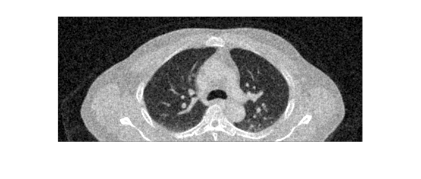
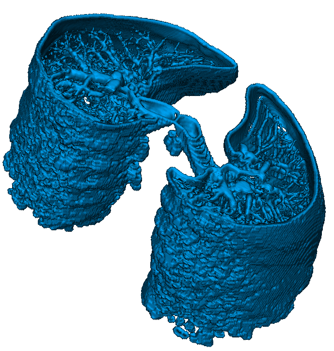

# Lung 3D-Segmentation in CT scans

## Introduction
Automated solutions to accelerate and standardize diagnostic processes are essential in many medical procedures. This project focuses on semantic segmentation for identifying specific regions within biomedical images. We developed an automatic algorithm for lung segmentation and boundary detection using CT volumes.

## Materials and Methods

### Dataset
The dataset consists of ten CT scans of the same patient recorded at different time steps.

### Algorithm
The algorithm processes the 3D volume slice by slice and extracts the lungs by analyzing the entire volume. The core steps are:

1. Loading DICOM image
2. Noise reduction using filters
3. Contrast adjustment
4. Image binarization
5. Removing white elements inside the lungs using `imerode`
6. Extracting the largest component using `getLargestCc`
7. Converting lungs to 1 by complementing the image
8. Filling the background with zeros to keep only the lungs
9. Extracting lungs from the original image using the mask
10. Performing edge detection with Sobel kernel

<p align="center">     </p></br>
<p align="center">    </p>
<p align="center">Algorithm steps from left to right, top to bottom</p>

## Results

Our algorithm achieves good and consistent lung segmentation using simple approaches without requiring expensive computations like deep learning techniques. It remains reliable across different time frames.

<p align="center"> </p>
<p align="center">3D-Lungs extraction visualization</p>

The algorithm performed best on the axial view due to higher spatial resolution. The robustness of the algorithm is demonstrated by consistent lung volume measurements across different time instances.

<p align="center"> </p>
<p align="center">Lungs volume variation along time</p>


<details>
    <summary>Instructions</summary>

## Setup 

- Open a command prompt and execute:
    ```console
    git clone https://github.com/RaffaeleBerzoini/lung-segmentation-3D.git
    cd lung-segmentation-3D/
    ```
- Go to the [dataset](https://data.kitware.com/#collection/579787098d777f1268277a27/folder/5aa313db8d777f0685786472
) page, select all the folder from _T_0_ to _T_90_ and download them
- The download should be named _Resources.zip_
- Move the zip file in the the `lung-segmentation-3D` folder that contains all the `.m` files.

The working directory should look similar to:

```text
lung-segmentation-3D   # your WRK_DIR
.
├── prepare_dataset.py
├── Resources.zip
└── .m files
```

- Open a command prompt and execute:
  ```console
    python prepare_dataset.py
  ```

Now your working directory should be:

```text
lung-segmentation-3D   # your WRK_DIR
.
├── prepare_dataset.py
├── Resources.zip
└── .m files
└── dataset
        ├── T_0
        ├── ...
        └── T_90
              ├── CT
              |    └── .dcm files
              └── liver segmentation
```  

## Execution

- Once the project has been downloaded and the dataset prepared, head into the project working directory and execute on the MATLAB command prompt: 
    ```shell
    >> main
    ```
    
The script will open and process all the CT scans and a plot of the lungs' volume will be shown at the end of the execution.

Once the script has been executed you will find on the MATLAB command prompt a short guide on how to access all the processed data with some examples for 3D visualization. 

</details>


## Authors
- Raffaele Berzoini  
- Aurora Anna Francesca Colombo  
- Davide Console  
